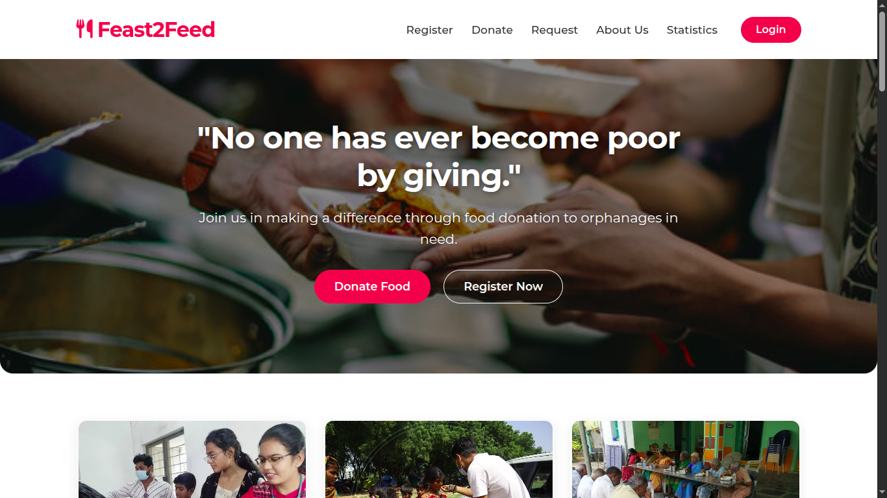

# 🍲 Feast2Feed – Web-Based Food Donation Platform  

**Feast2Feed** is a web-based food donation platform designed to connect **donors** with **NGOs** to reduce food wastage and feed underprivileged communities.  
The project addresses a critical social problem: while large amounts of food are wasted daily from **households, restaurants, weddings, and events**, countless people—especially **children in orphanages** and **individuals in shelters**—struggle to get even a single meal.  

---

## 🌍 Problem Statement  

- **Global Issue**: Nearly **one-third of all food produced** worldwide is wasted every year.  
- **India**: Around **21 million tonnes of food** is wasted annually, despite millions of people being undernourished.  
- **Tamil Nadu / Chennai**: The situation is severe, with **Chennai alone generating ~25 tonnes of food waste every day**.  

---

## 💡 Solution  

**Feast2Feed** provides a **service-based, not-for-profit solution** to bridge the gap between **food surplus** and **food scarcity**.  

### How It Works:
1. **Donors** (households, restaurants, event managers) log in and post surplus food donations.  
2. **NGOs** log in to their dashboards to view available donations in real time.  
3. NGOs claim donations, arrange pickup/delivery, and distribute food to orphanages, shelters, or street communities.  
4. **Donors** can track the full donation lifecycle: *claimed → picked up → delivered*.  
5. The platform integrates **GPS-to-address conversion** and sends **automated email notifications** to keep all parties updated.  

---

## ⚙️ Features  

✅ Donor registration & secure login  
✅ NGO registration & dashboard  
✅ Post & manage food donations  
✅ Real-time donation tracking (status updates)  
✅ GPS location auto-conversion to address  
✅ Automated email notifications  
✅ Volunteer coordination support  
✅ Secure authentication with **BCrypt password hashing**  
✅ Protection from **SQL Injection** using parameterized queries  

---

## 🏗️ Technical Stack  

- **Frontend**: HTML, CSS, Bootstrap, JavaScript  
- **Backend**: JSP, Servlets  
- **Database**: MySQL + JDBC  
- **Architecture**: MVC (Model-View-Controller)  
- **Security**: BCrypt password hashing, session management, SQL injection prevention  

---

## 🚀 Real-World Impact  

- **Wedding Halls**: Leftover food at midnight can be donated instantly instead of being thrown away.  
- **Restaurants**: Surplus meals can be redirected to those in need.  
- **Households & Festivals**: Families can donate extra food during celebrations.  

By making food redistribution **real-time and trackable**, Feast2Feed ensures that no edible food goes to waste while people remain hungry.  

---

## 🔮 Future Enhancements  

- Extend platform to donations beyond food → **clothes, books, medicines**  
- Mobile app version for wider reach  
- AI-powered food demand prediction for NGOs  
- Multi-language support for rural adoption  

---

## 📸 Screenshots

### Screenshot 1

### Screenshot 2

### Screenshot 3

### Screenshot 4
  <!-- rename if needed -->

### Screenshot 5

### Screenshot 6

### Screenshot 7

### Screenshot 8

### Screenshot 9

---

## 🤝 Contribution  

Contributions are welcome!  
If you’d like to improve features, fix bugs, or add enhancements:  

📜 License

This project is licensed under the MIT License – you are free to use, modify, and distribute with proper attribution.

✨ Acknowledgements

All NGOs and volunteers who inspired the project

Open-source community for tools and frameworks

Everyone working to reduce food wastage and feed the underprivileged

“Feast2Feed is more than just a web application—it is a meaningful solution that combines technology with social responsibility, efficiently connects donors with NGOs, and ensures that food reaches underprivileged communities.”
